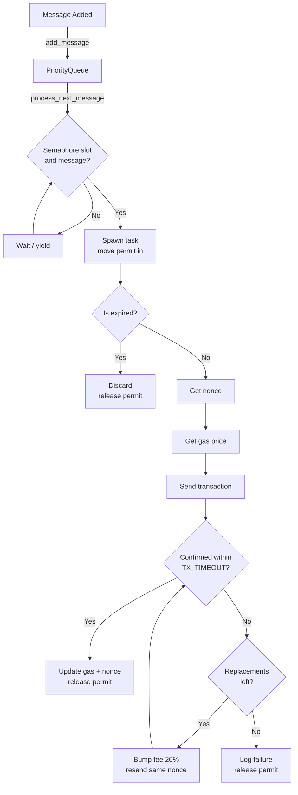

# Architecture

Bulkmail is a parallel transaction sender with pluggable chain adapters. It accepts
a stream of `Message` values from callers and lands them on-chain concurrently,
managing replay protection, fee pricing, timeouts, and retries automatically.

---

## Data Flow

```
Caller → add_message → PriorityQueue
                              ↓
              Sender::run (tokio::select! loop)
               ├─ new block → ReplayProtection::sync
               └─ semaphore slot + queued message
                       ↓
                 spawned task
                  ├─ ReplayProtection::next
                  ├─ FeeManager::get_fee_params
                  ├─ ChainClient::send_transaction
                  └─ wait for confirmation / timeout
                         ├─ confirmed → retry.handle_confirmed
                         └─ dropped   → retry.handle_dropped
```

---

## Module Map

| File | Role |
|------|------|
| `src/lib.rs` | Public API surface; top-level `Error` enum |
| `src/sender.rs` | Orchestrator; owns the queue and semaphore |
| `src/message.rs` | `Message` struct; `effective_priority` calculation |
| `src/adapter/mod.rs` | Chain-agnostic adapter traits |
| `src/adapter/ethereum.rs` | Ethereum adapter implementation |
| `src/chain.rs` | Legacy `Chain` client (Alloy WebSocket wrapper) |
| `src/nonce_manager.rs` | In-flight nonce tracking; per-block sync |
| `src/gas_price.rs` | Congestion detection; priority-fee scaling |
| `src/priority_queue.rs` | Max-heap over `effective_priority` |
| `examples/oracle_eth.rs` | Anvil-based simulation; not part of the library |

---

## Components

### Sender (`src/sender.rs`)

The top-level orchestrator. It owns:

- A `PriorityQueue` (behind `Arc<Mutex<_>>`) for pending messages.
- A `Semaphore` capped at `MAX_IN_FLIGHT_TRANSACTIONS = 16`.
- Adapter components: `ChainClient`, `FeeManager`, `ReplayProtection`, and `RetryStrategy`.

`run()` drives a `tokio::select!` loop:

```
loop {
    select! {
        Some(header) = block_stream.recv() => {
            replay.sync()
        }
        permit = semaphore.acquire_owned() => {
            if let Some(msg) = queue.pop() {
                tokio::spawn(process_message(permit, msg, ...))
            }
        }
    }
}
```

The `OwnedSemaphorePermit` is moved **into** the spawned task so it is held for the task's full lifetime, enforcing the concurrency cap.

---

### Message (`src/message.rs`)

Represents the caller's intent to send a transaction. Nonces and gas prices are
**not** stored here — they are bound late, immediately before submission.

Public fields:

| Field | Type | Description |
|-------|------|-------------|
| `to` | `Option<Address>` | Recipient; `None` for contract creation |
| `value` | `U256` | ETH value in wei |
| `data` | `Bytes` | Call data |
| `gas` | `u64` | Gas limit |
| `priority` | `u32` | Caller-assigned priority (0–100; values above 100 are clamped) |
| `deadline_ms` | `Option<u32>` | Relative deadline in milliseconds from `created_at_ms` |

Private fields (`created_at_ms: u64`, `retry_count: u32`) are managed by the
library and are not settable by callers.

**Effective priority formula:**

```
effective_priority = priority + retry_count + age_factor + deadline_factor
```

- `age_factor` grows one point per two seconds of wall time (based on epoch ms).
- `deadline_factor` is `MAX_PRIORITY (100)` when fewer than 2 blocks remain,
  `MAX_PRIORITY/3` when fewer than 10 blocks remain, and 0 otherwise.
- A message whose deadline has already passed returns 0, causing it to be
  filtered out before sending.

---

### Chain Clients (`src/adapter/mod.rs`, `src/chain.rs`)

The adapter-level `ChainClient` trait in `src/adapter/mod.rs` is the interface
used by `Sender` and adapter components. It exposes subscription, send, and
status-check operations in a chain-agnostic way.

`Chain` in `src/chain.rs` is the legacy Ethereum WebSocket client that wraps
Alloy’s provider and signer. The Ethereum adapter (`src/adapter/ethereum.rs`)
wraps this legacy client inside `EthClient` to satisfy the adapter trait.

`BlockReceiver = mpsc::Receiver<u64>` is used for block/slot notifications,
keeping the adapter interface mockable and easy to test.

---

### NonceManager (`src/nonce_manager.rs`)

Maintains two pieces of state guarded by a single mutex:

- `current: u64` — the on-chain confirmed nonce.
- `in_flight: BTreeSet<u64>` — nonces assigned to outstanding transactions.

`get_next_available_nonce` holds the lock while walking forward from `current`
until it finds a gap in the in-flight set.

`sync_nonce` is called on every new block. It fetches `eth_getTransactionCount`
and calls `update_current_nonce`, which advances the baseline and prunes any
in-flight entries below the new value.

---

### GasPriceManager (`src/gas_price.rs`)

Adapts the EIP-1559 priority fee to observed network conditions.

Internal state:

- `confirmation_times: VecDeque<Duration>` — rolling window of the last 10
  confirmation latencies.
- `priority_fee: u128` — exponential moving average of recently used priority
  fees (50/50 blend on each confirmation).

`get_gas_price(priority)` returns `(base_fee, priority_fee)`:

```
congestion_level  = avg(confirmation_times) mapped to Low/Medium/High (1×/2×/3×)
priority_pct      = 100% + (0..100%) proportional to message priority
priority_fee      = base_priority_fee × congestion_multiplier × priority_pct / 100
```

Result is clamped to `MAX_PRIORITY_FEE = 100 Gwei`. Base fee is currently a
static 2 Gwei placeholder — a production deployment should read
`baseFeePerGas` from the latest block header and apply EIP-1559 projection logic.

---

### PriorityQueue (`src/priority_queue.rs`)

A thin wrapper around `std::collections::BinaryHeap`. Effective priority is
captured at push time and stored alongside the message in a
`PrioritizedMessage` wrapper. The heap is a max-heap so `pop()` always returns
the highest-priority message.

---

## Transaction Lifecycle

```
1. Caller calls add_message(msg)
       └─ msg pushed to PriorityQueue

2. Sender::run loop acquires semaphore permit + pops msg
       └─ spawns task, permit moved into task

3. Task checks msg.is_expired()
       ├─ expired → mark_nonce_available, drop permit
       └─ not expired:
           ├─ nonce  = NonceManager::get_next_available_nonce()
           ├─ (base_fee, priority_fee) = GasPriceManager::get_gas_price(msg.effective_priority())
           ├─ tx = build TxEip1559 { nonce, gas, value, data, base_fee, priority_fee, ... }
           └─ pending = ChainClient::send_transaction(tx)

4. Watch for confirmation with TX_TIMEOUT = 3s
       ├─ confirmed:
       │     ├─ GasPriceManager::update_on_confirmation(elapsed, priority_fee)
       │     ├─ NonceManager::update_current_nonce(nonce + 1)
       │     └─ drop permit
       └─ timed out (handle_transaction_dropped):
             ├─ replacement_count < MAX_REPLACEMENTS (3)?
             │     ├─ new_priority_fee = priority_fee + priority_fee * 20 / 100
             │     ├─ re-send with same nonce, higher fee
             │     └─ loop back to step 4
             └─ exhausted → log failure, mark_nonce_available, drop permit

5. On any error or msg.can_retry() exhausted:
       └─ re-queue if retries remain, else log and discard
```

---

## Design Decisions

### Late binding of nonces and gas prices

Nonces and gas prices are assigned immediately before submission, not at message
creation. This allows messages to be re-queued, retried, or replaced without
invalidating any earlier state. A message sitting in the queue for several blocks
will receive a fresh nonce and fresh gas price when it is finally processed.

### ChainClient trait for testability

`Sender` depends on `Arc<dyn ChainClient>`, not `Arc<Chain>`. This makes it
possible to inject a `MockChainClient` in unit tests without spawning a live
WebSocket connection or an Anvil node. The `BlockReceiver = mpsc::Receiver<Header>`
return type for `subscribe_new_blocks` was chosen specifically because trait objects
cannot return `impl Trait`, and the channel type is straightforward to construct in
tests.

### Semaphore permit lifetime

The `OwnedSemaphorePermit` is moved into the spawned task — not dropped before
`tokio::spawn`. Dropping it before the spawn would release the slot immediately,
making the semaphore a no-op and allowing unlimited concurrency.

### Deadlock-free pending map access

`handle_transaction_dropped` removes a transaction from the `pending` map and
then calls `bump_transaction_fee`, which re-acquires the same lock. The original
code held the `MutexGuard` across the `.await` point, causing a self-deadlock
(tokio's `Mutex` is fair; the same task cannot re-acquire a lock it already holds).
The fix scopes the guard to a block so it is dropped before the async call.

### Fee replacement formula

Stuck transactions are replaced with `new_fee = fee + fee * 20 / 100`. The
original code used `fee * 20 / 100` (20% of the fee, not a 20% increase), which
produced a replacement transaction with a lower fee — guaranteeing it would never
be mined. The EIP-1559 mempool requires replacement fees to be at least 10% higher
than the original.

---

## Concurrency Constants

| Constant | Value | Meaning |
|----------|-------|---------|
| `MAX_IN_FLIGHT_TRANSACTIONS` | 16 | Maximum concurrent pending transactions |
| `TX_TIMEOUT` | 3 s | Time to wait before treating a transaction as dropped |
| `MAX_REPLACEMENTS` | 3 | Maximum fee-bump retries per transaction |
| `GAS_PRICE_INCREASE_PERCENT` | 20 | Percentage added to fee on each replacement |
| `MAX_RETRIES` | 3 | Maximum message-level retries (across all replacements) |

---

## Sender Flow Diagram



---

## Oracle Simulation

`src/bin/oracle.rs` is a self-contained simulation. It spawns a local
[Anvil](https://github.com/foundry-rs/foundry) node, wires up a `Chain` and
`Sender`, and continuously submits ETH transfer messages at random intervals.

It is not part of the published library and only compiles when building the binary:

```bash
cargo run --bin oracle   # requires anvil in PATH
```
